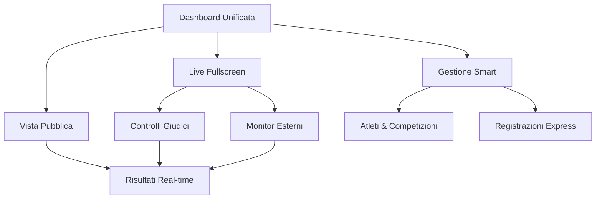

# A1Lifter - Documentazione Requisiti Prodotto Ottimizzata

## 1. Panoramica del Prodotto

A1Lifter è un sistema completo di gestione per competizioni di powerlifting, strongman, weightlifting e streetlifting con focus sull'esperienza utente ottimizzata. La piattaforma offre un'interfaccia intuitiva e fluida sul modello Apple, gestendo l'intero ciclo di vita di una competizione con workflow semplificati e accesso immediato alle funzionalità.

Il sistema elimina la complessità della gestione manuale attraverso un design minimalista, navigazione razionalizzata e automazione intelligente. Prioritizza velocità, chiarezza e usabilità senza compromettere le funzionalità professionali richieste da organizzatori, giudici e atleti.

## 2. Funzionalità Principali

### 2.1 Ruoli Utente

| Ruolo | Metodo di Registrazione | Permessi Principali |
|-------|------------------------|---------------------|
| Amministratore | Registrazione email con privilegi elevati | Gestione completa competizioni, atleti, utenti e configurazioni sistema |
| Giudice | Invito da amministratore con codice | Valutazione tentativi, accesso interfaccia giudizio, visualizzazione risultati live |
| Organizzatore | Registrazione email con approvazione | Gestione competizioni assegnate, registrazioni atleti, configurazione gare |
| Atleta | Registrazione pubblica | Iscrizione competizioni, visualizzazione risultati personali, gestione profilo |

### 2.2 Moduli Funzionali

Il sistema è organizzato in pagine essenziali con navigazione semplificata:

1. **Dashboard Unificata**: panoramica intelligente con widget personalizzabili, accesso diretto alle azioni più frequenti, notifiche contestuali
2. **Gestione Live Avanzata**: interfaccia fullscreen ottimizzata, vista pubblica sincronizzata per monitor esterni, controlli touch-friendly per giudici
3. **Gestione Atleti Streamlined**: anagrafica semplificata con import intelligente, visualizzazione record immediata, ricerca istantanea
4. **Competizioni Smart**: wizard di creazione guidato, template predefiniti, gestione stati automatizzata
5. **Registrazioni Semplificate**: processo di iscrizione in 3 step, validazione automatica, pagamenti integrati
6. **Risultati Immediati**: calcolo real-time, export one-click, condivisione automatica
7. **Configurazioni Essenziali**: impostazioni raggruppate logicamente, backup automatico, configurazione rapida

### 2.3 Dettagli Pagine

| Nome Pagina | Nome Modulo | Descrizione Funzionalità |
|-------------|-------------|-------------------------|
| Dashboard | Panoramica Generale | Visualizza statistiche competizioni attive, prossime gare, notifiche sistema, accesso rapido alle funzioni |
| Dashboard | Widget Statistiche | Mostra numero atleti registrati, competizioni in corso, risultati recenti con grafici interattivi |
| Gestione Atleti | Anagrafica Atleti | Crea, modifica, elimina profili atleti con dati personali, categoria peso, federazione di appartenenza |
| Gestione Atleti | Record Personali | Gestisce migliori prestazioni per disciplina, storico progressi, confronti statistici |
| Gestione Atleti | Importazione CSV | Carica atleti da file Excel/CSV con validazione dati e gestione errori |
| Gestione Competizioni | Creazione Competizioni | Configura nuove gare con date, location, tipo sport, regole specifiche |
| Gestione Competizioni | Configurazione Categorie | Definisce categorie peso, fasce età, divisioni tecniche per ogni competizione |
| Gestione Competizioni | Gestione Stati | Controlla workflow competizione: bozza, attiva, in corso, completata |
| Sistema Registrazioni | Iscrizioni Pubbliche | Permette registrazione atleti con selezione categoria, pagamento, conferma |
| Sistema Registrazioni | Validazione Categorie | Verifica automatica peso corporeo, età, requisiti federazione |
| Sistema Registrazioni | Gestione Pagamenti | Traccia stato pagamenti, genera ricevute, gestisce rimborsi |
| Gestione Live Avanzata | Interfaccia Fullscreen | Modalità immersiva senza distrazioni, controlli essenziali, visualizzazione ottimizzata per proiezione |
| Gestione Live Avanzata | Vista Pubblica Sincronizzata | Display dedicato per monitor esterni con dati real-time, panoramica completa per coach, sincronizzazione automatica |
| Gestione Live Avanzata | Controlli Giudici Touch | Interfaccia semplificata per tablet, voti immediati, feedback visivo istantaneo |
| Gestione Live Avanzata | Gestione Ordine Intelligente | Calcolo automatico sequenze, notifiche proattive, gestione pause ottimizzata |
| Gestione Live Avanzata | Timer Avanzato | Cronometro prominente, allarmi sonori/visivi, controlli gestuali per dispositivi touch |
| Risultati e Classifiche | Calcolo Punteggi | Applica formule IPF, Wilks, DOTS automaticamente, gestisce record |
| Risultati e Classifiche | Export Documenti | Genera PDF classifiche, Excel dettagliati, certificati partecipazione |
| Risultati e Classifiche | Pubblicazione Live | Aggiorna risultati in tempo reale, notifiche automatiche, condivisione social |
| Configurazioni Sistema | Gestione Discipline | Configura discipline per sport, tentativi massimi, unità misura |
| Configurazioni Sistema | Categorie Peso | Definisce classi peso standard e personalizzate per federazioni |
| Configurazioni Sistema | Backup e Sicurezza | Esporta dati competizioni, backup automatici, log attività utenti |

## 3. Processo Principale

### Flusso Organizzatore Ottimizzato
L'organizzatore accede alla dashboard unificata e utilizza il wizard guidato per creare competizioni con template predefiniti. Il sistema automatizza validazioni e configurazioni standard. Durante la gara, l'interfaccia live fullscreen fornisce controllo completo con un solo schermo, eliminando la necessità di navigare tra multiple pagine.

### Flusso Giudice Semplificato
Il giudice accede direttamente alla modalità giudizio tramite QR code o link diretto. L'interfaccia touch ottimizzata per tablet presenta solo i controlli essenziali con feedback immediato. La sincronizzazione è trasparente e automatica.

### Flusso Atleta Immediato
L'atleta completa l'iscrizione in 3 step guidati con validazione real-time. Durante la gara, accede alla vista pubblica per monitorare progressi senza necessità di login. Riceve notifiche automatiche sui risultati.

## 4. Design dell'Interfaccia Utente

### 4.1 Stile di Design Apple-Inspired

- **Colori Primari**: Sistema di colori adattivo con Bianco/Nero per contrasto massimo, Blu (#007AFF) per azioni primarie in stile iOS
- **Colori Secondari**: Grigi semantici (#F2F2F7, #8E8E93), Verde (#34C759) per successo, Rosso (#FF3B30) per errori
- **Stile Pulsanti**: Bordi arrotondati (12px), effetti glassmorphism, animazioni fluide 0.3s ease, stati focus accessibili
- **Font**: SF Pro Display per titoli, SF Pro Text per corpo, dimensioni scalabili con preferenze sistema
- **Layout**: Design minimalista con whitespace generoso, navigazione tab-based, gesture-friendly per touch
- **Icone**: SF Symbols style con peso variabile, dimensioni adattive, animazioni micro-interazioni

### 4.2 Panoramica Design Pagine Ottimizzate

| Nome Pagina | Nome Modulo | Elementi UI |
|-------------|-------------|-------------|
| Dashboard Unificata | Centro di Controllo | Layout modulare con widget drag-drop, quick actions prominenti, notifiche intelligenti non invasive |
| Dashboard Unificata | Statistiche Smart | Card animate con numeri grandi, grafici interattivi touch-friendly, indicatori di tendenza |
| Live Fullscreen | Controllo Gara | Interface immersiva edge-to-edge, controlli gestuali, timer gigante con animazioni fluide |
| Live Fullscreen | Vista Pubblica | Display ottimizzato per proiezione, informazioni essenziali, aggiornamenti real-time senza refresh |
| Gestione Smart | Atleti Express | Lista con ricerca istantanea, swipe actions, form inline editing, import drag-drop |
| Gestione Smart | Competizioni Wizard | Processo guidato con progress indicator, template selection, preview live delle impostazioni |
| Registrazioni Express | Iscrizione 3-Step | Flow lineare con validazione progressiva, pagamenti one-tap, conferma immediata |
| Controlli Giudici | Interface Touch | Pulsanti grandi per tablet, feedback aptico, sincronizzazione trasparente, modalità offline |
| Risultati Real-time | Live Updates | Tabelle auto-refresh, highlight animati per nuovi record, export istantaneo, condivisione social |
| Configurazioni Essenziali | Setup Rapido | Gruppi logici collassabili, toggle con preview, backup automatico, reset intelligente |

### 4.3 Responsività e Accessibilità

Il sistema utilizza design adattivo con breakpoint fluidi e supporto completo per dispositivi touch. L'interfaccia live è ottimizzata per display esterni (4K/8K) con scaling automatico. Include supporto per modalità scura/chiara, high contrast, e preferenze di movimento ridotto. Navigazione completamente accessibile via tastiera e screen reader con ARIA labels completi.

