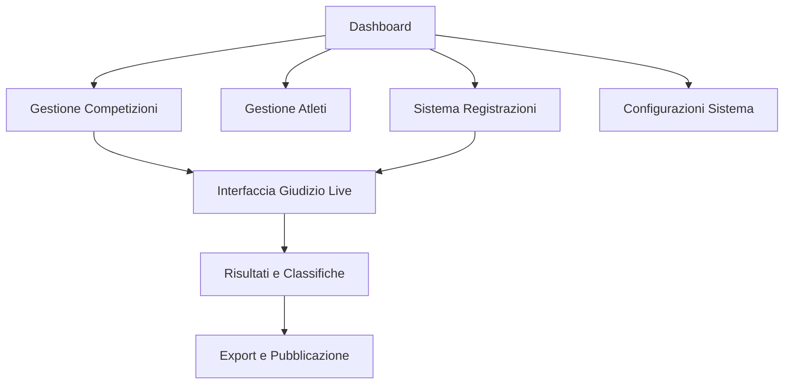

# A1Lifter - Documentazione Requisiti Prodotto

## 1. Panoramica del Prodotto

A1Lifter è un sistema completo di gestione per competizioni di powerlifting, strongman, weightlifting e streetlifting. La piattaforma offre strumenti professionali per organizzatori, giudici e atleti, gestendo l'intero ciclo di vita di una competizione dalla registrazione alla pubblicazione dei risultati finali.

Il sistema risolve i problemi di gestione manuale delle competizioni, automatizza il calcolo dei punteggi secondo le formule ufficiali (IPF, Wilks, DOTS) e fornisce un'interfaccia moderna per il monitoraggio in tempo reale delle gare.

## 2. Funzionalità Principali

### 2.1 Ruoli Utente

| Ruolo | Metodo di Registrazione | Permessi Principali |
|-------|------------------------|---------------------|
| Amministratore | Registrazione email con privilegi elevati | Gestione completa competizioni, atleti, utenti e configurazioni sistema |
| Giudice | Invito da amministratore con codice | Valutazione tentativi, accesso interfaccia giudizio, visualizzazione risultati live |
| Organizzatore | Registrazione email con approvazione | Gestione competizioni assegnate, registrazioni atleti, configurazione gare |
| Atleta | Registrazione pubblica | Iscrizione competizioni, visualizzazione risultati personali, gestione profilo |

### 2.2 Moduli Funzionali

Il sistema è composto dalle seguenti pagine principali:

1. **Dashboard**: panoramica generale, statistiche competizioni, notifiche importanti, accesso rapido alle funzioni principali
2. **Gestione Atleti**: anagrafica completa, record personali, storico competizioni, importazione CSV
3. **Gestione Competizioni**: creazione gare, configurazione categorie e regole, gestione stati competizione
4. **Sistema Registrazioni**: iscrizioni atleti, gestione pagamenti, validazione categorie peso
5. **Interfaccia Giudizio Live**: valutazione tentativi in tempo reale, gestione ordine atleti, cronometro
6. **Risultati e Classifiche**: calcolo automatico punteggi, export PDF/Excel, pubblicazione risultati
7. **Configurazioni Sistema**: gestione discipline, categorie peso, formule calcolo, backup dati

### 2.3 Dettagli Pagine

| Nome Pagina | Nome Modulo | Descrizione Funzionalità |
|-------------|-------------|-------------------------|
| Dashboard | Panoramica Generale | Visualizza statistiche competizioni attive, prossime gare, notifiche sistema, accesso rapido alle funzioni |
| Dashboard | Widget Statistiche | Mostra numero atleti registrati, competizioni in corso, risultati recenti con grafici interattivi |
| Gestione Atleti | Anagrafica Atleti | Crea, modifica, elimina profili atleti con dati personali, categoria peso, federazione di appartenenza |
| Gestione Atleti | Record Personali | Gestisce migliori prestazioni per disciplina, storico progressi, confronti statistici |
| Gestione Atleti | Importazione CSV | Carica atleti da file Excel/CSV con validazione dati e gestione errori |
| Gestione Competizioni | Creazione Competizioni | Configura nuove gare con date, location, tipo sport, regole specifiche |
| Gestione Competizioni | Configurazione Categorie | Definisce categorie peso, fasce età, divisioni tecniche per ogni competizione |
| Gestione Competizioni | Gestione Stati | Controlla workflow competizione: bozza, attiva, in corso, completata |
| Sistema Registrazioni | Iscrizioni Pubbliche | Permette registrazione atleti con selezione categoria, pagamento, conferma |
| Sistema Registrazioni | Validazione Categorie | Verifica automatica peso corporeo, età, requisiti federazione |
| Sistema Registrazioni | Gestione Pagamenti | Traccia stato pagamenti, genera ricevute, gestisce rimborsi |
| Interfaccia Giudizio Live | Valutazione Tentativi | Interfaccia touch per giudici con voti valido/non valido, correzioni |
| Interfaccia Giudizio Live | Gestione Ordine | Calcola automaticamente ordine atleti, gestisce cambi peso, pause |
| Interfaccia Giudizio Live | Cronometro Gara | Timer per tentativi, pause tra discipline, gestione tempi regolamentari |
| Risultati e Classifiche | Calcolo Punteggi | Applica formule IPF, Wilks, DOTS automaticamente, gestisce record |
| Risultati e Classifiche | Export Documenti | Genera PDF classifiche, Excel dettagliati, certificati partecipazione |
| Risultati e Classifiche | Pubblicazione Live | Aggiorna risultati in tempo reale, notifiche automatiche, condivisione social |
| Configurazioni Sistema | Gestione Discipline | Configura discipline per sport, tentativi massimi, unità misura |
| Configurazioni Sistema | Categorie Peso | Definisce classi peso standard e personalizzate per federazioni |
| Configurazioni Sistema | Backup e Sicurezza | Esporta dati competizioni, backup automatici, log attività utenti |

## 3. Processo Principale

### Flusso Organizzatore
L'organizzatore accede al sistema, crea una nuova competizione configurando discipline, categorie e regole specifiche. Gestisce le registrazioni degli atleti validando categorie peso e pagamenti. Durante la gara utilizza l'interfaccia live per coordinare giudici e monitorare progressi. Al termine pubblica risultati ufficiali e genera documentazione.

### Flusso Giudice
Il giudice riceve credenziali di accesso per competizioni specifiche. Durante la gara utilizza l'interfaccia touch per valutare tentativi in tempo reale. Il sistema sincronizza automaticamente i voti con altri giudici e calcola validità tentativi secondo regole federazione.

### Flusso Atleta
L'atleta si registra pubblicamente, seleziona competizioni disponibili e completa iscrizione con pagamento. Riceve conferme automatiche e può monitorare risultati live durante la gara. Accede a storico prestazioni e certificati partecipazione.

## 4. Design dell'Interfaccia Utente

### 4.1 Stile di Design

- **Colori Primari**: Nero (#000000) per header e elementi principali, Blu (#3B82F6) per azioni primarie
- **Colori Secondari**: Grigio (#6B7280) per testi secondari, Verde (#10B981) per successo, Rosso (#EF4444) per errori
- **Stile Pulsanti**: Arrotondati con ombre sottili, effetti hover fluidi, stati disabilitati chiari
- **Font**: Inter per interfaccia generale, dimensioni 14px base, 16px per titoli, 12px per dettagli
- **Layout**: Design card-based con spaziature consistenti, navigazione top-bar, sidebar collassabile
- **Icone**: Lucide React con stile outline, dimensioni 20px standard, 24px per azioni principali

### 4.2 Panoramica Design Pagine

| Nome Pagina | Nome Modulo | Elementi UI |
|-------------|-------------|-------------|
| Dashboard | Panoramica Generale | Grid responsive con card statistiche, grafici Recharts, lista notifiche con badge |
| Dashboard | Widget Statistiche | Card con numeri grandi, grafici a torta per distribuzione, progress bar per obiettivi |
| Gestione Atleti | Tabella Atleti | DataTable con filtri avanzati, paginazione, azioni bulk, modal per dettagli |
| Gestione Atleti | Form Atleta | Form multi-step con validazione real-time, upload foto, selezione categoria automatica |
| Gestione Competizioni | Form Competizione | Tabs per sezioni, date picker, select multipli per discipline, preview configurazione |
| Gestione Competizioni | Lista Competizioni | Card layout con stati colorati, filtri per tipo sport, azioni rapide |
| Sistema Registrazioni | Form Iscrizione Pubblica | Wizard step-by-step, validazione peso live, integrazione pagamenti, conferma email |
| Interfaccia Giudizio Live | Panel Giudizio | Layout full-screen, pulsanti touch grandi, timer prominente, sync status |
| Risultati e Classifiche | Tabelle Risultati | Tabelle sortabili con highlight record, export buttons, filtri categoria |
| Configurazioni Sistema | Pannelli Configurazione | Accordion per sezioni, toggle switches, form inline editing, preview modifiche |

### 4.3 Responsività

Il sistema è progettato mobile-first con breakpoint Tailwind standard. L'interfaccia si adatta automaticamente da smartphone a desktop con navigazione touch-friendly per giudici su tablet. Le tabelle utilizzano scroll orizzontale su mobile e layout stack per form complessi.

