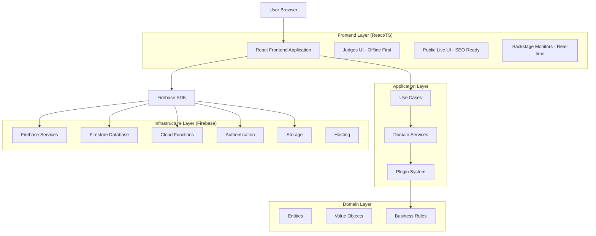
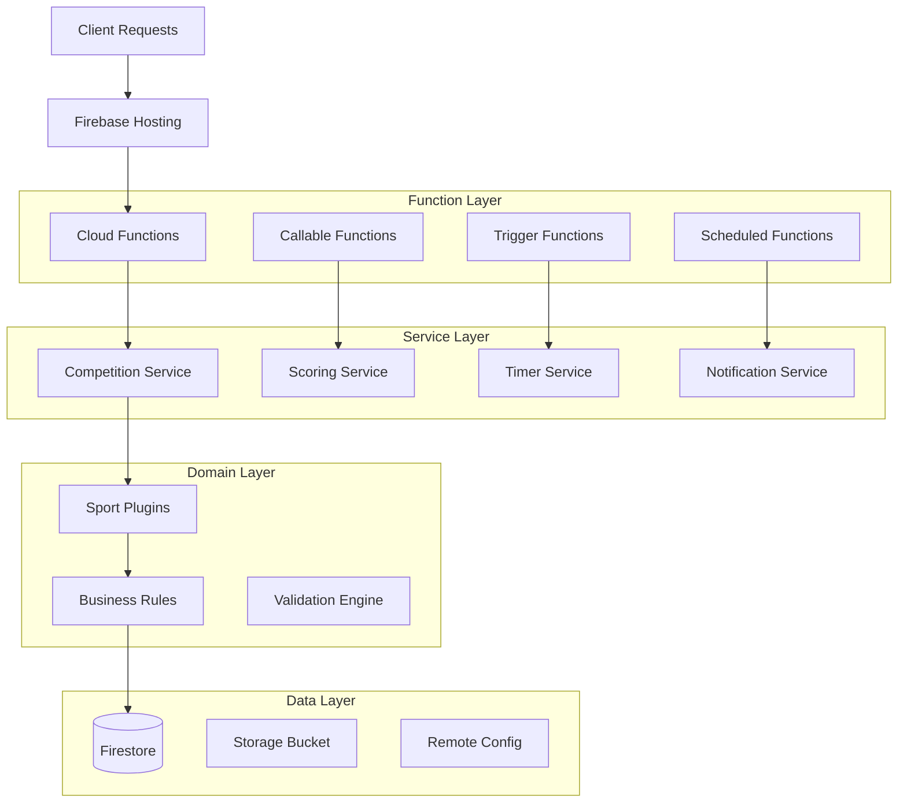
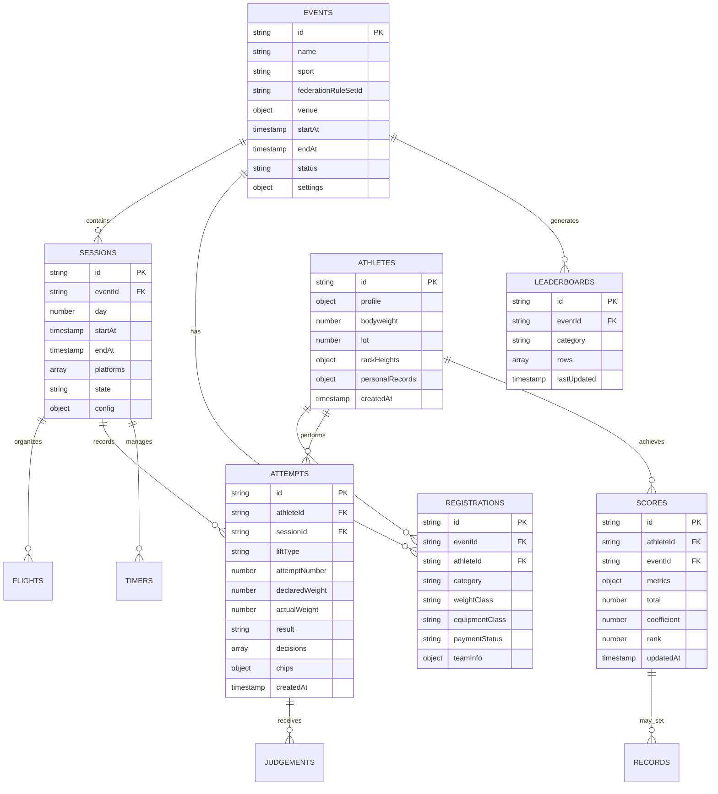

# A1Lifter - Documentazione Architettura Tecnica

## 1. Architettura Design



## 2. Technology Description

- **Frontend**: React@19 + TypeScript + Vite + TailwindCSS@3 + Radix UI
- **State Management**: TanStack Query + React Hook Form + Zustand (minimal global state)
- **Backend**: Firebase Cloud Functions (Node.js)
- **Database**: Firestore (PostgreSQL-compatible document store)
- **Authentication**: Firebase Auth with custom claims RBAC
- **Storage**: Firebase Storage with CDN
- **Hosting**: Firebase Hosting with HTTP/2/3
- **Real-time**: Firestore snapshot listeners
- **Offline**: PWA with background sync
- **Testing**: Vitest + React Testing Library + Playwright E2E
- **Build**: Vite with code splitting and tree shaking
- **Analytics**: GA4 with consent mode

## 3. Route Definitions

| Route | Purpose | Performance Target |
|-------|---------|-------------------|
| / | Dashboard unificata con overview competizioni | LCP ≤ 2.0s |
| /competitions | Gestione competizioni con wizard creazione | LCP ≤ 2.5s |
| /athletes | Gestione atleti con import/export | LCP ≤ 2.0s |
| /registrations | Sistema registrazioni 3-step | LCP ≤ 1.8s |
| /live/:eventId | Interfaccia live fullscreen per organizzatori | LCP ≤ 1.5s |
| /judge/:sessionId | UI giudici offline-first con pulsanti XL | LCP ≤ 1.0s |
| /public/:eventId | Vista pubblica live SEO-ready | LCP ≤ 2.0s |
| /monitor/:sessionId | Monitor backstage big-screen | LCP ≤ 1.2s |
| /results/:eventId | Risultati e classifiche con export | LCP ≤ 2.0s |
| /settings | Configurazioni sistema e backup | LCP ≤ 2.5s |

## 4. API Definitions (Cloud Functions)

### 4.1 Core Callable Functions

**Gestione Sessioni**
```typescript
// POST /startSession
interface StartSessionRequest {
  sessionId: string;
  platformIds: string[];
  officials: { userId: string; role: string; platformId?: string }[];
}

interface StartSessionResponse {
  success: boolean;
  sessionState: SessionState;
  serverTimestamp: Timestamp;
}
```

**Timer Management**
```typescript
// POST /startTimer
interface StartTimerRequest {
  sessionId: string;
  platformId: string;
  duration: number; // seconds
  type: 'attempt' | 'warmup' | 'break';
}

interface StartTimerResponse {
  success: boolean;
  startedAt: Timestamp;
  serverOffset: number; // ms for client sync
}
```

**Attempt Management**
```typescript
// POST /proposeNextAttempt
interface ProposeNextAttemptRequest {
  sessionId: string;
  athleteId: string;
  currentAttempt: AttemptData;
}

interface ProposeNextAttemptResponse {
  success: boolean;
  proposedWeight: number;
  rackHeight?: number;
  autoProgression: boolean;
}
```

**Live Publishing**
```typescript
// POST /publishLive
interface PublishLiveRequest {
  eventId: string;
  sessionId?: string;
  categories?: string[];
}

interface PublishLiveResponse {
  success: boolean;
  publishedAt: Timestamp;
  leaderboardSnapshot: LeaderboardData[];
}
```

### 4.2 Trigger Functions

**onAttemptWrite**: Validazione regole sport, calcolo punteggi, aggiornamento leaderboard
**onRegistrationWrite**: Validazione categorie, calcolo flight/heat, notifiche
**onScoreUpdate**: Aggiornamento ranking, controllo record, audit log
**onTimerUpdate**: Sincronizzazione cross-platform, notifiche stato

## 5. Server Architecture Diagram



## 6. Data Model

### 6.1 Data Model Definition



### 6.2 Data Definition Language

**Events Collection**
```javascript
// Firestore Collection: events
{
  id: "event_2024_nationals",
  name: "Campionati Nazionali 2024",
  sport: "powerlifting", // powerlifting | weightlifting | strongman | crossfit | streetlifting
  federationRuleSetId: "ipf_2024",
  venue: {
    name: "PalaSport Roma",
    address: "Via dello Sport 1, Roma",
    platforms: 4
  },
  startAt: Timestamp,
  endAt: Timestamp,
  status: "draft", // draft | active | live | completed
  settings: {
    allowLateRegistrations: false,
    autoProgressWeights: true,
    livestreamEnabled: true
  },
  createdAt: Timestamp,
  updatedAt: Timestamp
}

// Firestore Index
CREATE INDEX idx_events_status_start ON events(status ASC, startAt ASC);
CREATE INDEX idx_events_sport_status ON events(sport ASC, status ASC);
```

**Sessions Collection**
```javascript
// Firestore Collection: sessions
{
  id: "session_day1_morning",
  eventId: "event_2024_nationals",
  day: 1,
  startAt: Timestamp,
  endAt: Timestamp,
  platforms: [
    { id: "platform_1", name: "Platform A", active: true },
    { id: "platform_2", name: "Platform B", active: true }
  ],
  state: "scheduled", // scheduled | warmup | active | break | completed
  config: {
    warmupDuration: 900, // 15 minutes
    attemptDuration: 60,  // 1 minute
    breakDuration: 300    // 5 minutes
  },
  officials: {
    headJudge: "user_123",
    judges: ["user_456", "user_789"],
    scorer: "user_101"
  }
}

// Firestore Index
CREATE INDEX idx_sessions_event_day ON sessions(eventId ASC, day ASC);
CREATE INDEX idx_sessions_state ON sessions(state ASC, startAt ASC);
```

**Athletes Collection**
```javascript
// Firestore Collection: athletes
{
  id: "athlete_mario_rossi",
  profile: {
    firstName: "Mario",
    lastName: "Rossi",
    dateOfBirth: "1990-05-15",
    gender: "M",
    nationality: "ITA",
    federation: "FIPL",
    licenseNumber: "12345"
  },
  bodyweight: 82.5,
  lot: 15,
  rackHeights: {
    squat: 5,
    bench: 3,
    deadlift: 7
  },
  personalRecords: {
    squat: 200,
    bench: 150,
    deadlift: 250,
    total: 600
  },
  createdAt: Timestamp,
  updatedAt: Timestamp
}

// Firestore Index
CREATE INDEX idx_athletes_name ON athletes(profile.lastName ASC, profile.firstName ASC);
CREATE INDEX idx_athletes_federation ON athletes(profile.federation ASC);
```

**Attempts Collection**
```javascript
// Firestore Collection: attempts
{
  id: "attempt_mario_squat_1",
  athleteId: "athlete_mario_rossi",
  sessionId: "session_day1_morning",
  platformId: "platform_1",
  liftType: "squat", // squat | bench | deadlift | snatch | cleanjerk
  attemptNumber: 1,
  declaredWeight: 180,
  actualWeight: 180,
  result: "good", // good | no_lift | pending
  decisions: [
    { judgeId: "user_456", decision: "good", timestamp: Timestamp },
    { judgeId: "user_789", decision: "good", timestamp: Timestamp },
    { judgeId: "user_101", decision: "no_lift", timestamp: Timestamp }
  ],
  chips: {
    red: 2,    // 25kg plates
    blue: 1,   // 20kg plates
    yellow: 1, // 15kg plates
    green: 0,  // 10kg plates
    white: 1   // 5kg plates
  },
  rackHeight: 5,
  createdAt: Timestamp,
  judgedAt: Timestamp
}

// Firestore Indexes
CREATE INDEX idx_attempts_session_athlete ON attempts(sessionId ASC, athleteId ASC, attemptNumber ASC);
CREATE INDEX idx_attempts_platform_time ON attempts(platformId ASC, createdAt DESC);
CREATE INDEX idx_attempts_result ON attempts(result ASC, createdAt DESC);
```

**Scores Collection (Denormalized)**
```javascript
// Firestore Collection: scores
{
  id: "score_mario_nationals_2024",
  athleteId: "athlete_mario_rossi",
  eventId: "event_2024_nationals",
  category: "M_83kg_Open",
  metrics: {
    squat: { best: 190, attempts: [180, 190, 200] },
    bench: { best: 140, attempts: [130, 140, 145] },
    deadlift: { best: 240, attempts: [220, 240, 250] },
    total: 570
  },
  coefficient: {
    dots: 385.2,
    wilks: 378.5,
    ipfPoints: 82.3
  },
  rank: {
    overall: 3,
    category: 1,
    ageGroup: 1
  },
  records: [
    { type: "national", lift: "squat", previous: 185, new: 190 }
  ],
  updatedAt: Timestamp
}

// Firestore Indexes
CREATE INDEX idx_scores_event_category_rank ON scores(eventId ASC, category ASC, rank.category ASC);
CREATE INDEX idx_scores_event_total ON scores(eventId ASC, metrics.total DESC);
CREATE INDEX idx_scores_athlete ON scores(athleteId ASC, updatedAt DESC);
```

**Security Rules Implementation**
```javascript
rules_version = '2';
service cloud.firestore {
  match /databases/{database}/documents {
    // Helper functions
    function isAuthenticated() {
      return request.auth != null;
    }
    
    function hasRole(role) {
      return isAuthenticated() && 
             request.auth.token.get('roles', {}).get(role, false) == true;
    }
    
    function isEventStaff(eventId) {
      return hasRole('organizer') || hasRole('headJudge') ||
             exists(/databases/$(database)/documents/events/$(eventId)/officials/$(request.auth.uid));
    }
    
    function isOwner(userId) {
      return isAuthenticated() && request.auth.uid == userId;
    }
    
    // Events - Public read, organizer write
    match /events/{eventId} {
      allow read: if true;
      allow create, update: if hasRole('organizer');
      allow delete: if hasRole('admin');
      
      // Sessions within events
      match /sessions/{sessionId} {
        allow read: if true;
        allow write: if isEventStaff(eventId);
      }
      
      // Attempts within events
      match /attempts/{attemptId} {
        allow read: if true;
        allow create, update: if isEventStaff(eventId) || hasRole('judge');
        allow delete: if hasRole('headJudge');
      }
      
      // Leaderboards - read public, write by system
      match /leaderboards/{leaderboardId} {
        allow read: if true;
        allow write: if hasRole('scorer') || hasRole('organizer');
      }
    }
    
    // Athletes - public read, organizer write
    match /athletes/{athleteId} {
      allow read: if true;
      allow create, update: if hasRole('organizer') || isOwner(athleteId);
      allow delete: if hasRole('admin');
    }
    
    // Registrations - public read, authenticated write own
    match /registrations/{registrationId} {
      allow read: if true;
      allow create: if isAuthenticated();
      allow update: if isOwner(resource.data.userId) || hasRole('organizer');
      allow delete: if hasRole('organizer');
    }
    
    // Scores - public read, system write
    match /scores/{scoreId} {
      allow read: if true;
      allow write: if hasRole('scorer') || hasRole('organizer');
    }
    
    // Judgements - judges can create, head judge can modify
    match /judgements/{judgementId} {
      allow read: if true;
      allow create: if hasRole('judge') || hasRole('headJudge');
      allow update, delete: if hasRole('headJudge');
    }
    
    // Audit logs - read by staff, write by system
    match /auditLogs/{logId} {
      allow read: if hasRole('organizer') || hasRole('admin');
      allow write: if false; // Only Cloud Functions can write
    }
  }
}
```

**Initial Data Seeding**
```javascript
// Seed script for development/staging
const seedData = {
  // Sample event
  events: {
    "demo_event_2024": {
      name: "Demo Competition 2024",
      sport: "powerlifting",
      federationRuleSetId: "ipf_2024",
      venue: {
        name: "Demo Gym",
        address: "123 Demo Street",
        platforms: 2
      },
      status: "active",
      startAt: new Date('2024-06-01T09:00:00Z'),
      endAt: new Date('2024-06-01T18:00:00Z')
    }
  },
  
  // Sample athletes
  athletes: {
    "demo_athlete_1": {
      profile: {
        firstName: "Demo",
        lastName: "Athlete",
        gender: "M",
        dateOfBirth: "1990-01-01"
      },
      bodyweight: 75.0,
      personalRecords: {
        squat: 150,
        bench: 100,
        deadlift: 180
      }
    }
  }
};
```