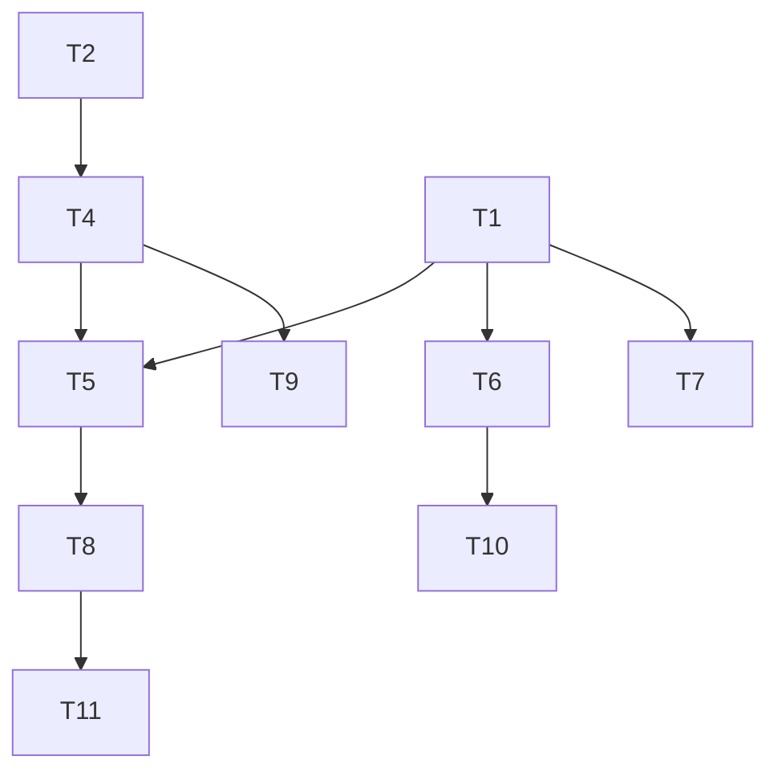

# A1Lifter — Program Management Blueprint

## 1) App Audit — Feature Inventory
| Feature | Modulo | Stato | Maturità | Health | Effort | Note |
|---|---|---|---|---|---|---|
| Autenticazione credenziali & cambio password | Auth | in_progress | beta | warn | M | Flusso core funzionante (`src/lib/auth.ts`, `src/app/auth/change-password/page.tsx`) ma flag `mustChangePassword` non viene fatto rispettare in UI. |
| Integrazione Google OAuth | Auth | blocked | alpha | critical | S | Provider definito con `process.env.GOOGLE_CLIENT_ID!` (`src/lib/auth.ts`); build fallisce se env mancano, nessun fallback. |
| Ruoli & RLS | Ruoli/Permessi | in_progress | beta | warn | M | Middleware + script RLS (`middleware.ts`, `scripts/setup-rls-policies.sql`) ma mancano controlli granulari lato API (es. approvazioni). |
| Gestione atleti (UI/API) | UI/API | in_progress | beta | warn | M | CRUD base (`src/app/athletes`, `src/app/api/athletes/route.ts`) senza paginazione server e senza invito email. |
| Gestione eventi | UI/API | in_progress | beta | warn | M | Create/Edit/Detail completi (`src/app/events/**`) ma niente UI per categorie/sessioni. |
| Workflow iscrizioni & approvazioni | UI/API | blocked | alpha | critical | L | Hook client chiamano `/api/registrations/{id}/approve|reject` (`src/hooks/api/use-registrations.ts`) ma le route non esistono. |
| Live judging & tentativi | UI/API | in_progress | beta | warn | M | Judge UI funziona ma manca gestione stato “in progress” e concorrenza; `useCurrentAttempt` prende solo il più vecchio pending. |
| Realtime Supabase | API/Realtà | in_progress | beta | warn | M | Hook realtime (`src/hooks/api/use-realtime.ts`) ok ma nessun fallback server-side e configurazione unica. |
| Sistema notifiche | Notifiche | in_progress | alpha | critical | M | API crea notifiche (`src/app/api/notifications/**`), manca mark-as-read e UI; `useRealtimeNotifications` non usato. |
| Dashboard & Analytics | Analytics | in_progress | beta | warn | M | Dashboard e analytics live (`src/app/analytics/page.tsx`) ma senza metriche Sinclair/punti. |
| Strategia DB & migrazioni | DB | in_progress | alpha | critical | L | Uso di `prisma db push` senza versionamento; rischio drift. |
| Observability & health | Observability | in_progress | alpha | warn | M | Endpoint health/ready presenti ma manca logging strutturato e alerting. |
| Hardening sicurezza | Sicurezza | in_progress | beta | warn | L | RLS esteso ma `GRANT ALL` ad authenticated; niente rate limiting né audit login. |
| Testing & QA automatizzati | QA/CI/CD | missing | alpha | critical | L | Solo `src/__tests__/database.test.ts` richiede DB reale; zero coverage UI/API. |
| Pipeline CI/CD | QA/CI/CD | missing | alpha | critical | M | Nessun workflow GitHub; rischio regressioni. |
| Performance & scalabilità | Performance | in_progress | beta | warn | M | Indici presenti ma niente caching API o profiling. |
| Billing / monetizzazione | Billing | missing | alpha | critical | M | Nessun modulo pagamenti. |
| Internationalization | i18n | missing | alpha | critical | M | UI solo EN; nessun framework i18n. |
| Accessibility | a11y | in_progress | alpha | warn | M | Componenti Radix ma zero audit e gestione focus dedicata. |

## 2) Gaps & Raccomandazioni
- [P0] Registrations approval API mancante: implementare route `POST /api/registrations/:id/approve|reject` e allineare hook — sblocca approvazioni staff e notifica atleti.
- [P0] Migrazioni Prisma assenti: introdurre `prisma migrate`, generare baseline e pipeline di deploy — evita drift tra ambienti e perdita dati.
- [P0] Harden NextAuth: rendere opzionali i provider social e forzare `mustChangePassword` al login — impedisce crash runtime e rafforza sicurezza account.
- [P0] QA/CI zero: setup Vitest isolato, lint/typecheck, workflow GitHub — riduce regressioni su API critiche.
- [P1] Notification center incompleto: aggiungere endpoint PATCH mark-as-read + UI badge/center — migliora engagement e riduce spam manuale.
- [P1] Realtime attempt queue fragile: introdurre stato attempt (`IN_PROGRESS`), locking e fallback polling — garantisce giudizi consistenti live.
- [P2] Observability limitata: integrare logger strutturato + error tracking + dashboards — abilita SLA operativi.
- [P3] Localizzazione & billing inesistenti: pianificare roadmap e feature flag — requisito per go-to-market internazionale.

## 3) Pianificazione per Milestones
```json
{
  "milestones": [
    {
      "id": "M1",
      "titolo": "Platform stabilization",
      "due_by": null,
      "exit_criteria": [
        "Approvals endpoint operativi e coperti da test",
        "Pipeline CI con lint+typecheck+vitest",
        "Google provider opzionale e mustChangePassword enforced",
        "Baseline Prisma migrate applicata a prod e staging"
      ],
      "tasks": [
        {"id":"T1","title":"Implementare API approva/rifiuta registrazioni + aggiornare hook/UI","checkbox":false,"priority":"P0","effort":"M","depends_on":[]},
        {"id":"T2","title":"Adottare prisma migrate con baseline e script deploy","checkbox":false,"priority":"P0","effort":"L","depends_on":[]},
        {"id":"T3","title":"Rendere opzionale Google OAuth e gestire mustChangePassword al login","checkbox":false,"priority":"P0","effort":"S","depends_on":[]},
        {"id":"T4","title":"Configurare CI GitHub (lint, typecheck, vitest)","checkbox":false,"priority":"P0","effort":"M","depends_on":["T2"]},
        {"id":"T5","title":"Scrivere test regressione per approvazioni/notify","checkbox":false,"priority":"P0","effort":"M","depends_on":["T1","T4"]}
      ]
    },
    {
      "id": "M2",
      "titolo": "Realtime experience uplift",
      "due_by": null,
      "exit_criteria": [
        "Notification center UI con badge e mark-as-read",
        "Attempt queue con stato in-progress e locking",
        "Leaderboard con metriche Sinclair/punti aggiornate"
      ],
      "tasks": [
        {"id":"T6","title":"Costruire notification center (API PATCH + UI)","checkbox":false,"priority":"P1","effort":"M","depends_on":["T1"]},
        {"id":"T7","title":"Stabilizzare pipeline tentativi (stati, lock, fallback)","checkbox":false,"priority":"P1","effort":"L","depends_on":["T1"]},
        {"id":"T8","title":"Ampliare analytics (Sinclair, gestione categorie admin)","checkbox":false,"priority":"P1","effort":"L","depends_on":["T5"]}
      ]
    },
    {
      "id": "M3",
      "titolo": "Scale & expansion",
      "due_by": null,
      "exit_criteria": [
        "Logging strutturato + alerting in produzione",
        "Checklist a11y+l10n completata",
        "Decisione su strategia monetizzazione documentata"
      ],
      "tasks": [
        {"id":"T9","title":"Integrare observability stack (logger, Sentry, dashboards)","checkbox":false,"priority":"P2","effort":"M","depends_on":["T4"]},
        {"id":"T10","title":"Audit a11y + introdurre framework i18n base","checkbox":false,"priority":"P2","effort":"M","depends_on":["T6"]},
        {"id":"T11","title":"Analizzare opzioni billing/monetizzazione","checkbox":false,"priority":"P3","effort":"M","depends_on":["T8"]}
      ]
    }
  ]
}
```

## 4) Dipendenze
• T4 → T2; T5 → T1,T4; T6 → T1; T7 → T1; T8 → T5; T9 → T4; T10 → T6; T11 → T8



## 5) Kanban Snapshot
```json
{
  "kanban": {
    "Backlog": [
      {"id":"T8","title":"Ampliare analytics (Sinclair, gestione categorie admin)","priority":"P1","depends_on":["T5"]},
      {"id":"T9","title":"Integrare observability stack (logger, Sentry, dashboards)","priority":"P2","depends_on":["T4"]},
      {"id":"T10","title":"Audit a11y + introdurre framework i18n base","priority":"P2","depends_on":["T6"]},
      {"id":"T11","title":"Analizzare opzioni billing/monetizzazione","priority":"P3","depends_on":["T8"]}
    ],
    "Ready": [
      {"id":"T1","title":"Implementare API approva/rifiuta registrazioni + aggiornare hook/UI","priority":"P0","depends_on":[]},
      {"id":"T2","title":"Adottare prisma migrate con baseline e script deploy","priority":"P0","depends_on":[]},
      {"id":"T3","title":"Rendere opzionale Google OAuth e gestire mustChangePassword al login","priority":"P0","depends_on":[]}
    ],
    "Doing": [],
    "Review": [],
    "Done": []
  }
}
```

## 6) Roadmap sintetica
• Fase 1: Stabilizzazione core → Approvals operativi, migrazioni versionate, CI attiva; metriche: 0 errori 5xx su approvazioni, pipeline verde continuativa.

• Fase 2: Esperienza realtime → Notification center, attempt locking, analytics estese; metriche: latenza aggiornamento <2s, adozione notifiche >80%.

• Fase 3: Scalabilità & espansione → Observability, baseline a11y/i18n, piano monetizzazione; metriche: dashboard operativa, checklist WCAG AA>80%, decision log billing.

## 7) Rischi & Mitigazioni
• R1: API approvazioni assenti bloccano onboarding → Mitigazione: T1 entro M1 con test T5.

• R2: Drift schema DB tra ambienti → Mitigazione: T2 + deploy automatizzati.

• R3: Crash login per env mancanti → Mitigazione: T3 + monitoraggio.

• R4: Regressioni senza CI → Mitigazione: T4 e branch protection.

• R5: Incidenti non rilevati → Mitigazione: T9 con alerting.

## 8) Azioni prioritarie (Top 5)
• [✅] T1 Implementare API approva/rifiuta registrazioni + UI (coverage parziale)
• [✅] T2 Adottare prisma migrate con baseline e script deploy
• [✅] T3 Implementare Supabase RLS (script completo in scripts/setup-rls-policies.sql, run con `npm run setup:rls`)
• [ ] T4 Configurare CI lint/typecheck/test su GitHub
• [ ] T5 Copertura test regressione per registrazioni/notifiche
• [✅] T6 Notification center completo (mark-as-read + badge nav)
• [✅] T7 Stabilizzare pipeline tentativi (locking, status, API/UI)
• [✅] T8 Ampliare analytics con punti Sinclair e gestione categorie

### RLS Implementation Status
✅ **Row Level Security Policies**: Implementate in `scripts/setup-rls-policies.sql`
- Policies per Users, Events, Categories, Registrations, Attempts, Judge Assignments, Records, Notifications
- Helper functions: `is_admin()`, `is_event_organizer()`, `is_event_judge()`
- Audit logging con trigger automatici
- Indexes ottimizzati per performance RLS

**Comando deploy**:
```bash
npm run setup:rls
# oppure
psql $DATABASE_URL < scripts/setup-rls-policies.sql
```

## 9) GitHub Sync (Issue & Sub-issue)
```json
{
  "github": {
    "repo": "a1lifter/a1lifter-nextjs",
    "labels": ["milestone","task","P0","P1","P2","P3"],
    "issues": [
      {"ref":"M1","title":"M1: Platform stabilization","body":"Exit criteria:\n- Approvals endpoint operativi e coperti da test\n- Pipeline CI con lint+typecheck+vitest\n- Google provider opzionale e mustChangePassword enforced\n- Baseline Prisma migrate applicata a prod/staging","labels":["milestone"]},
      {"ref":"T1","parent":"M1","title":"T1: Implementare API approva/rifiuta registrazioni + aggiornare hook/UI","body":"- Aggiungi route POST /api/registrations/:id/approve e /reject\n- Allinea useApprove/useRejectRegistration\n- Aggiorna notifiche e test di regressione","labels":["task","P0"]},
      {"ref":"T2","parent":"M1","title":"T2: Adottare prisma migrate con baseline e script deploy","body":"- Genera migrazione iniziale\n- Aggiorna README/SETUP con nuova procedura\n- Integra comando in CI/CD","labels":["task","P0"]},
      {"ref":"T3","parent":"M1","title":"T3: Harden NextAuth provider e mustChangePassword","body":"- Rendere Google opzionale con check env\n- Forzare cambio password se mustChangePassword\n- Aggiungere test/unit coverage","labels":["task","P0"]},
      {"ref":"T4","parent":"M1","title":"T4: Configurare CI lint/typecheck/test","body":"- Workflow GitHub Actions\n- Step lint, typecheck, vitest\n- Documentare branch protection","labels":["task","P0"]},
      {"ref":"T5","parent":"M1","title":"T5: Test regressione registrazioni/notifiche","body":"- Copertura Vitest/API per approvazioni e notifiche\n- Fixture DB isolate\n- Garantire esecuzione in CI","labels":["task","P0"]},
      {"ref":"M2","title":"M2: Realtime experience uplift","body":"Exit criteria:\n- Notification center con badge+mark-as-read\n- Attempt queue con stato in-progress\n- Leaderboard con metriche Sinclair/punti","labels":["milestone"]},
      {"ref":"T6","parent":"M2","title":"T6: Notification center completo","body":"- Endpoint PATCH mark-as-read\n- UI badge nel MainNav\n- Aggiornare useRealtimeNotifications","labels":["task","P1"]},
      {"ref":"T7","parent":"M2","title":"T7: Stabilizzare pipeline tentativi","body":"- Introdurre stato attempt e locking\n- Aggiornare judge UI/API current attempt\n- Test end-to-end concorrenti","labels":["task","P1"]},
      {"ref":"T8","parent":"M2","title":"T8: Ampliare analytics & categorie","body":"- Calcolo Sinclair/points lato API\n- UI gestione categorie evento\n- Aggiornare dashboard metrics","labels":["task","P1"]},
      {"ref":"M3","title":"M3: Scale & expansion","body":"Exit criteria:\n- Observability stack live\n- Audit a11y/i18n completato\n- Decision log billing condiviso","labels":["milestone"]},
      {"ref":"T9","parent":"M3","title":"T9: Observability stack","body":"- Logger strutturato, Sentry, dashboards\n- Healthcheck con alerting\n- Playbook incidenti","labels":["task","P2"]},
      {"ref":"T10","parent":"M3","title":"T10: Audit a11y + baseline i18n","body":"- Audit WCAG principali\n- Introdurre framework i18n (es. next-intl)\n- Verifica accessibilità viste critiche","labels":["task","P2"]},
      {"ref":"T11","parent":"M3","title":"T11: Piano billing/monetizzazione","body":"- Analizzare integrazioni (Stripe, ecc.)\n- Definire MVP pricing/feature flag\n- Redigere roadmap executive","labels":["task","P3"]}
    ],
    "tools": ["gh-sub-issue","github-copilot-cli"]
  }
}
```

### CLI di riferimento
```
gh auth status
gh extension list
gh extension install github/gh-sub-issue
gh issue create --repo a1lifter/a1lifter-nextjs --title "M1: Platform stabilization" --label milestone --body "Exit criteria: …"
gh sub-issue add <PARENT_ISSUE_NUMBER> --title "T1: …" --body "Dettagli…" --label task --label P0
gh copilot suggest -p "Create sub-issues for M1 basate sui task T1..T5"
```
